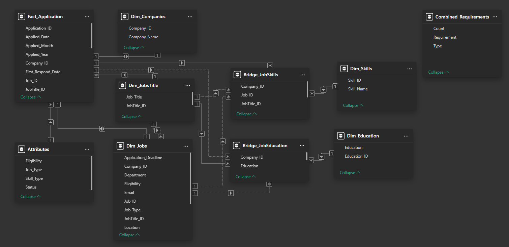
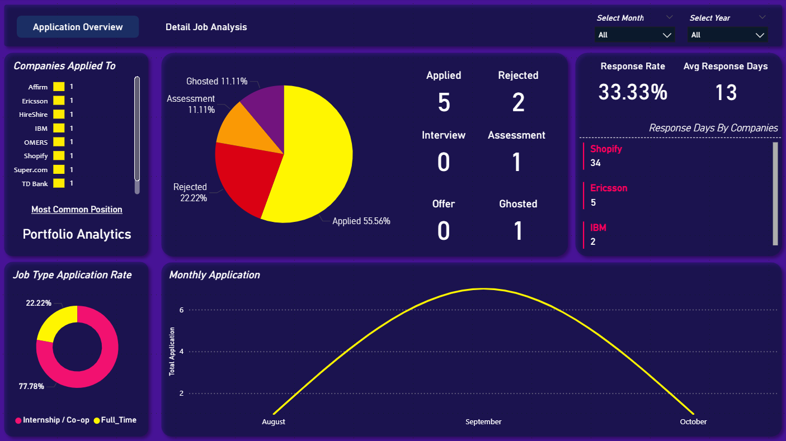
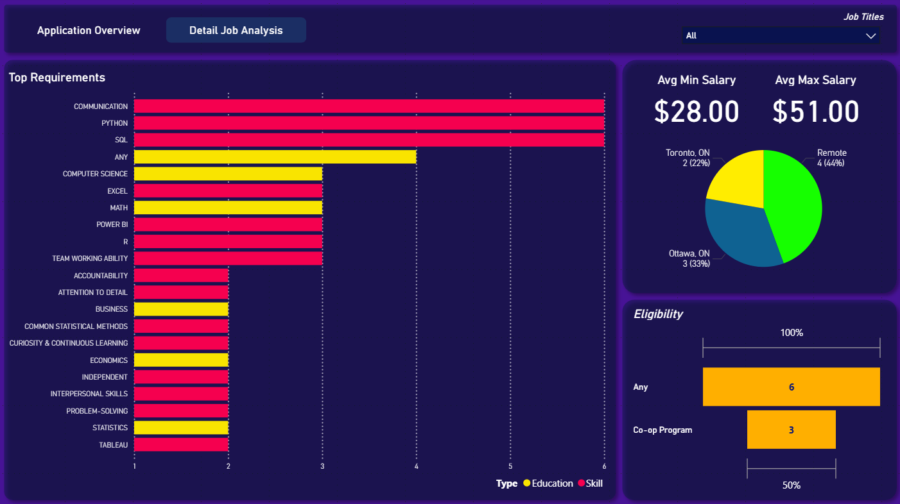

# Job Application Tracker 

## Project Overview
Job searching is often a manual and overwhelming process, making it difficult to track progress and identify which skills are most in-demand. This project addresses these challenges by implementing a structured, data-driven approach. The resulting analytics dashboard provides key insights into application success rates, helps identify high-value skills to focus on, and allows for strategic optimization of the job search process.
## Features
**Comprehensive Application Tracking**
Captures over 15 data points for each application, including job title, company, status, and required skills (soft, hard, and asset)
**Automated Data Cleaning and Transformation**
Utilizes Power Query to perform robust ETL processes on the raw data
**Dynamic Star Schema Data Model**
Employs a scalable data model for efficient and accurate analysis
**Interactive Power BI Dashboard**
Visualizes key metrics such as:
- Offer vs. Rejection vs. Ghosted rates
- Top required skills by job title
- Application activity over time
- Average company response times
- Average Salary Range
## Technology Stack
| Component | Tools Used |
|------------|------------|
| **Data Entry** | Microsoft Excel (Data Validation Lists) |
| **ETL** | Power Query (M Language) |
| **Data Modeling** | Power BI (Star Schema, DAX) |
| **Visualization** | Power BI (Custom Visuals + Python Integration) |
| **Validation** | Python (Pandas) + Jupyter Notebook |
| **Version Control** | Git & GitHub |
## Data Flow
1. **Data Entry:** Applications entered manually into Excel  
2. **ETL (Power Query):**
   - Fix data types and normalize multi-skill columns  
   - Split, unpivot, and deduplicate skills  
   
3. **Data Model:**  
   - Establish relationships (1-to-many) between fact and dimension tables  
   
4. **Power BI Visualization:**  
   - Import model → Build visuals → Add DAX measures → Create slicers & interactions 
   
   

## Insights Highlight
- Most Applications are concentrated in **Portfolio Analyst** position
- The **average response time** was **13 days**, with a **response rate of 33%**  
- **Top 5 in-demand skills:** Communication, Python, SQL, Excel, Power BI 
- **Top 3 in-demand education program:** Computer Science, Math, Business
- **Highest Application Status ratio** seen in roles requiring at **IBM**
## Detailed Walkthrough
For an in-depth, step-by-step exploration of the data cleaning, transformation, and modeling process, including M code snippets and Python validation, please refer to the Jupyter Notebook: [Job Application Analysis Notebook](job_application_analysis.ipynb)
## Future Enhancements
- Web Scraping: Automating the data entry process by scraping job details
## Author
**Stephanie Cheng**