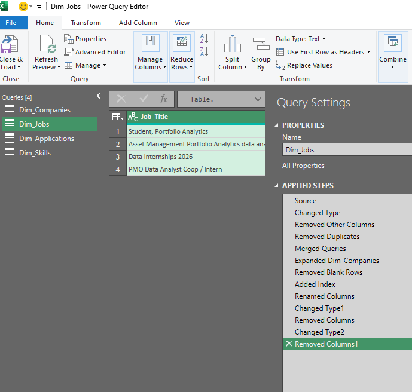
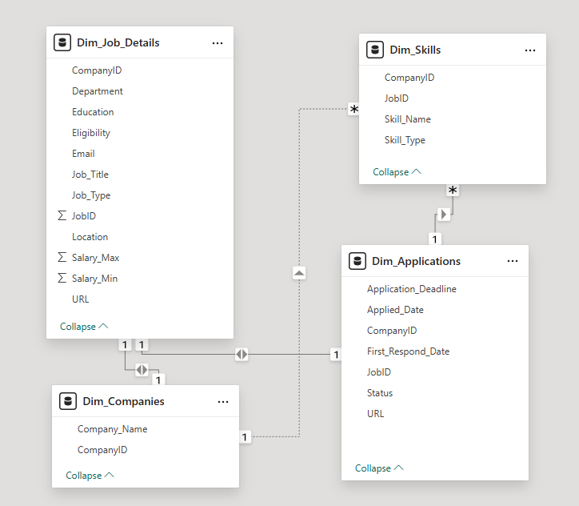

# Job Application Tracker 

## Project Overview
Job searching is often a manual and overwhelming process, making it difficult to track progress and identify which skills are most in-demand. This project addresses these challenges by implementing a structured, data-driven approach. The resulting analytics dashboard provides key insights into application success rates, helps identify high-value skills to focus on, and allows for strategic optimization of the job search process.
## Features
**Comprehensive Application Tracking**
Captures over 15 data points for each application, including job title, company, status, and required skills (soft, hard, and asset)
**Automated Data Cleaning and Transformation**
Utilizes Power Query to perform robust ETL processes on the raw data
**Dynamic Star Schema Data Model**
Employs a scalable data model for efficient and accurate analysis
**Interactive Power BI Dashboard**
Visualizes key metrics such as:
- Offer vs. Rejection vs. Ghosted rates
- Top required skills by job title
- Application activity over time
- Average company response times
## Technology Stack
**Data Entry & ETL**: Microsoft Excel, Power Query (M Language)
**Data Modeling & Visualization**: Microsoft Power BI (DAX)
**Project Documentation & Validation**: Jupyter Notebook (Python, Pandas), Git & GitHub
## Data Source / Data Entry
All raw data is manually entered into a structured Excel table named `data_entry`. To ensure data integrity and prevent errors, several columns (such as 'Job Type' and 'Status') use dropdown lists. These lists are dynamically populated from a separate `list` sheet using Excel's data validation feature, guaranteeing consistency across all entries.
## ETL Process & Data Model
The ETL process is handled entirely within Excel's Power Query Editor. After connecting to the `data_entry` table, a series of transformations are applied to clean, shape, and model the data into a star schema.
Key steps include:
- **Correcting Data Types**: Ensuring all columns are correctly formatted
- **Creating Dimension Tables**: Extracting unique values to create clean dimension tables for companies, jobs, and applications
- **Normalizing Skills Data**: Transforming the multi-value 'skills' column by splitting it by delimiter and unpivoting the results. This creates a normalized `dim_skills` table where each skill has its own row

The final, clean tables are then related to form a star schema data model, which is the foundation for the Power BI dashboard.

## Data Visualization (Power BI)
The final data model is loaded into Power BI to create an interactive dashboard. The dashboard is designed to provide at-a-glance insights into the job search, answering key questions through a clean and intuitive user interface. Visualizations include KPI cards for top-line metrics, charts for trend analysis, and slicers for dynamic filtering by company or job title.
## Detailed Walkthrough
For an in-depth, step-by-step exploration of the data cleaning, transformation, and modeling process, including M code snippets and Python validation, please refer to the Jupyter Notebook: job_application_analysis.ipynb
## Future Enhancements
- Web Scraping: Automating the data entry process by scraping job details
- Predictive Analysis: Building a simple model to predict the likelihood of receiving an interview based on job requirements